# QNAMaker Deployments


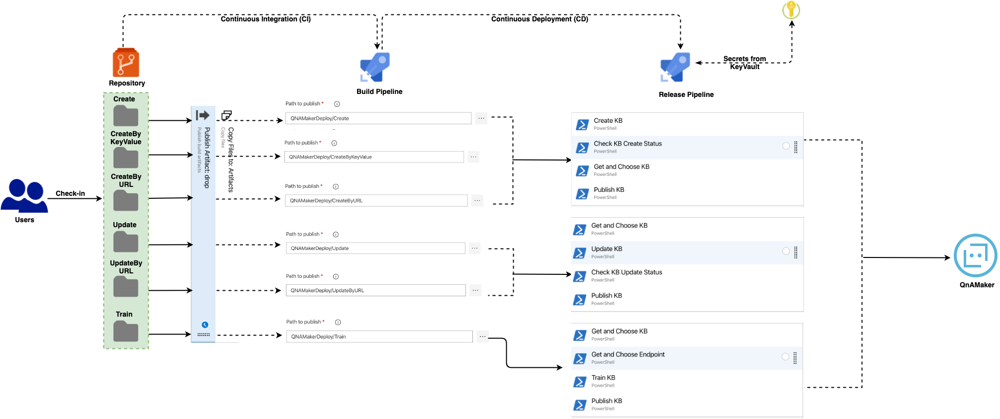

The purpose of this document is to provide an idea on how to perform automated deployments of some of the server side resources like QnAMaker. 

This is primarily created and maintained by developers or various researches/data experts of departments across org to maintain a workable, acceptable and highly flexible question/answer set.

Since this is a resource not primarily managhed by devs, we need a way to automate deployment of the same. Similar procedure can be followed for other such as Logic App, Bots etc.

## Assumptions

- QnAMaker is created already through Portal or by some other means
- KnowledgeBases - known as KBs may or may not exist
- Automated Deployment scripts will add/update KBs

## Folders

### Deployments -

- QnAMakerDeploy - This folder contains actual deplouyment scripts for Create/Update QnAMaker KBs. Exact same structure will be checked into the repository. Tools like Azure DevOps can then run scripts to send data to QnAMaker resource using REST API endpoints

  1. Create - Script(s) in this folder would allow users to Create a new KB. The script follows JSON file approach, where one has to specify the Questions/Answers as json fields

     ```
     {
       "id": 0,
       "answer": "Let us go to INOX!!",
       "source": "General",
       "questions": [
       	"Where to go for a movie?"
       ],
       "metadata": []
     }
     ```

     

  2. CreateByKeyValue - Primarily for people from non-dev background, can actually update a very simple key value JSON. 

     ```
     {
         "name": "CreateKB by KeyValue",
         "qnaList": [
             
             { "How is it today": "Nice and Sunny" },
             { "How are you": "Fit & Healthy" },
             { "Like this model": "I love Mercs, Audis" }
     
         ]
     }
     ```

  3. CreateByURL - Similar approach but using URLs - i.e. KB files stored in some accessible locations as per QnAMaker prescribed standard

     ```
     {
         "name": "From XLX File FAQ",
         "urls": [
     
             "https://docs.microsoft.com/en-us/azure/cognitive-services/Emotion/FAQ"
         ]
     
     }
     ```

  4. Update - Scripts here would allow users to add/update/delete questions from a particular KB

     ```
     {
         "update": {
             "qnaList": [
                 {
                     "id": 1,
                     "answer": "Let us explore the new PVR at Kolkata!",
                     "source": "General",
                     "questions": {
     
                         "add": [ "How to go there223?" ]
                         
     
                      }
                 }
             ]
         }
     }
     ```

     

  5. UpdateByURL

     ```
     {
         "update": {
             "urls": [
     
                 "https://docs.microsoft.com/en-in/azure/cognitive-services/qnamaker/faqs",
                 "https://docs.microsoft.com/en-us/bot-framework/resources-bot-framework-faq"
             ]
         }
     }
     ```

     

  6. Train

     ```
     {
         "feedbackRecords": [
             {
                 "qnaId": 1,
                 "userId": "de3bf09894a645da88a10b873de13c19",
                 "userQuestion": "qna maker with luis223"
             }
         ]
     }
     ```

### **Deployment Processes**

The CI part is straight forward but is actually extremely important. As you know CI implies the building the project and creating build artifacts; which would be used by Release or Deployment pipeline.

This process need slight change here as there is no build process to perform! You can refer to the [source code](https://github.com/monojit18/QNAMakerTestApp) in Github to have a better understanding of how project is structured.

So let us go by each of the KB access operations and how these would be deployed ultimately:

### **Create Pipelines**

### **Create**

#### **Repository folder** - *Create*

#### **CI Pipeline** 

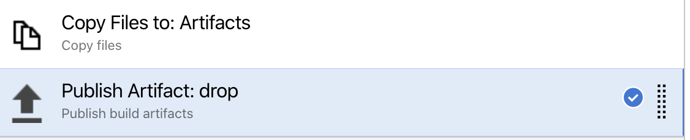

Task is to copy all files of Create folder and place it into a *drop* folder under build staging directory; a very standard ADO task. So, only configuration that you need to do -

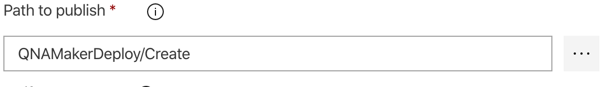

So that is it....ADO task will do rest

#### **CD** **Pipeline**

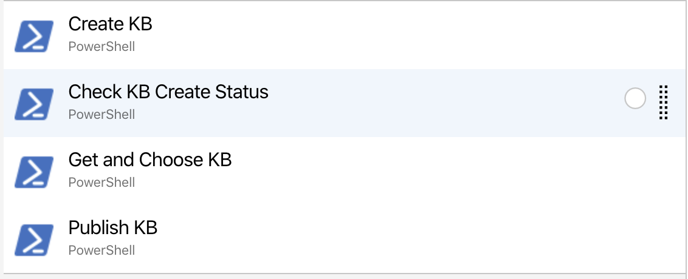

Each Task is only having inline PowerShell script to call appropriate

[QnAMaker REST API](https://westus.dev.cognitive.microsoft.com/docs/services/5a93fcf85b4ccd136866eb37/operations/5ac266295b4ccd1554da75ff).

**Let us examine what each task has in store**:

Pipeline variables for each pipeline are same baring few exceptions:

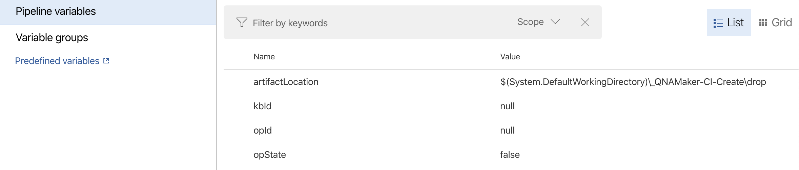

Look at the *artifactLocation -* This is the path of the CI pipeline artifact for CD pipeline for *Create* operation. Other variables are used across PowerShell scripts. You would see references for the same in the scripts' snippets below:

#### **Create KB - Creates the Knowledge base in QnAMaker**

```powershell
# Write your PowerShell commands here.

Write-Host "Create KB";

$body = Get-Content $(artifactLocation)\CreateKB.json;
Write-Host $body;

$url = $(BaseURL) + "/knowledgebases/create"
$contentType = $(ContentType)

$headers = @{
$(ApiKey) = "$(Ocp-Apim-Subscription-Key)"
};

$response = Invoke-RestMethod -Method "POST" -Uri $url
-ContentType $contentType -Headers $headers -Body $body
Write-Host $response;

$operationId = $response.operationId;
"##vso[task.setvariable variable=opId]$operationId"
```

#### **Check KB Create Status -** Checks the status of the previous Create step

```powershell
# Write your PowerShell commands here.

Write-Host "Check KB Create Status";

$url = $(BaseURL) + "/operations/$(opId)"
$contentType = $(ContentType)

$headers =@{
$(ApiKey) = "$(Ocp-Apim-Subscription-Key)"
};

$response = Invoke-RestMethod -Method "GET" -Uri $url
-ContentType $contentType -Headers $headers

Write-Host $response;
$operationState = $response.operationState;
Write-Host $operationState

$shouldContinue = $False;
if ($operationState -eq "Succeeded")
{
Write-Host $operationState
$shouldContinue = $True;
}

"##vso[task.setvariable variable=opState]$shouldContinue"
```

#### **Get and Choose KB -** Chooses a KB from the list of KBs in QnAMaker

```powershell
# Write your PowerShell commands here.

Write-Host "Get and Chose KB";
Write-Host $(opState);

$url = $(BaseURL) + "/knowledgebases"
$contentType = $(ContentType)

$headers =@{
$(ApiKey) = "$(Ocp-Apim-Subscription-Key)"
};

$response = Invoke-RestMethod -Method "GET" -Uri $url
-ContentType $contentType -Headers $headers

Write-Host $response;

$kbRef = $response.knowledgebases[0];
$knowledgeId = $kbRef.id;
Write-Host $knowledgeId;

"##vso[task.setvariable variable=kbId]$knowledgeId"
```

####  

#### **Publish KB -** Publishes a KB in QnAMaker

This is when the KB will be available in QnAMaker portal for use by everyone

```powershell
# Write your PowerShell commands here.

Write-Host "Update KB";

$url = $(BaseURL) + "/knowledgebases/$(kbId)"
$contentType = $(ContentType)

$headers =@{
$(ApiKey) = "$(Ocp-Apim-Subscription-Key)"
};

$response = Invoke-RestMethod -Method "POST" -Uri $url
-ContentType $contentType -Headers $headers;

Write-Host $response;
```

### **CreateByKeyValue**

#### **Repository folder** - *CreateByKeyValue*

#### **CI Pipeline**

All Tasks are same as for *Create* step above - not repeating here

#### **CD** **Pipeline**

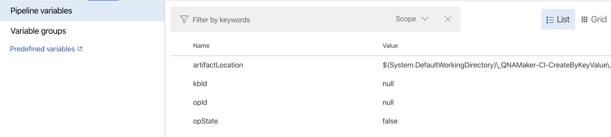

All Tasks are same as for *Create* step above - not repeating here; except the PowerShell script for *Create KB* step...which is given below:

```
# Write your PowerShell commands here.

Write-Host "Create KB";

$qnaInfo= Get-Content -Raw -Path $(artifactLocation)\CreateKB.json;
Write-Host $qnaInfo;
$qnaInfo = ConvertFrom-Json $qnaInfo

$body =[PSCustomObject] @{
    name = ""
    qnaList =  [System.Collections.ArrayList]@()
}

for ($i = 0; $i -lt $qnaInfo.qnaList.Count; $i++)
{
    $body.name = $qnaInfo.name
    $newInfo = [PSCustomObject]@{

        id = -1
        answer = ""
        source = "General"
        questions = [System.Collections.ArrayList]@()

    }
    
    foreach ($key in $qnaInfo.qnaList[$i].psobject.Properties)
    {
        
        $newInfo.id = $i
        $newInfo.answer = $key.Value
        $newInfo.questions.Add($key.Name)

    }

    $body.qnaList.Add($newInfo)

}

$body  = ConvertTo-Json $body -Depth 3
Write-Host $body

$url = $(BaseURL) + "/knowledgebases/create"
$contentType = $(ContentType)

$headers =@{
$(ApiKey) = "$(Ocp-Apim-Subscription-Key)"
};

$response = Invoke-RestMethod -Method "POST" -Uri $url
-ContentType #$contentType -Headers $headers -Body $body

Write-Host $response;
$operationId = $response.operationId;
Write-Host $operationId

"##vso[task.setvariable variable=opId]$operationId"
```

### **CreateByURL Pipeline**

#### **Repository folder** - *CreateByURL*

#### **CI** **Pipeline**

All Tasks and corresponding PowerShell scripts are same as for *Create* step above

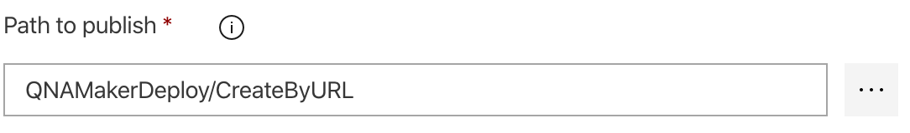


#### **CD** **Pipeline**

!(/Users/monojitdattams/Development/Projects/DotNetCore_Projects/QNAMakerTestApp/Assets/CreateByURL.png)

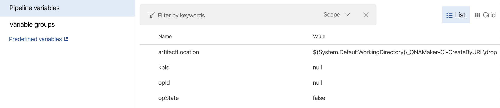

Look at the *artifactLocation -* This is the path of the CI pipeline artifact for CD pipeline for *CreateByURL* operation. Other variables are used across PowerShell scripts.

All Tasks and corresponding PowerShell scripts are same as for *Create* step above


### **Update Pipelines**

### **Update**

#### **Repository folder** - *Update*

#### **CI Pipeline**


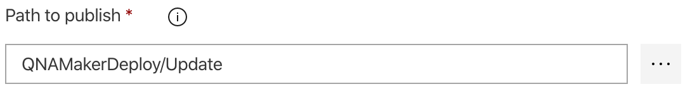


#### **CD** **Pipeline**

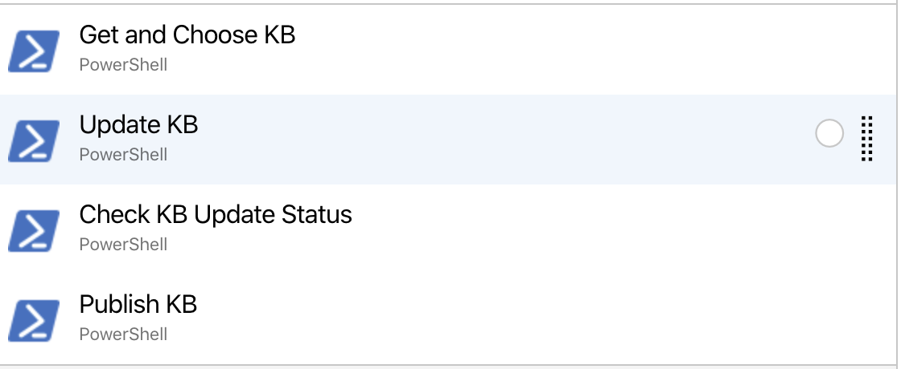

Each Task is only having inline PowerShell script to call appropriate

[QnAMaker REST API](https://westus.dev.cognitive.microsoft.com/docs/services/5a93fcf85b4ccd136866eb37/operations/5ac266295b4ccd1554da75ff).

**Let us examine what each task has in store**:

Pipeline variables for each pipeline are same baring few exceptions:

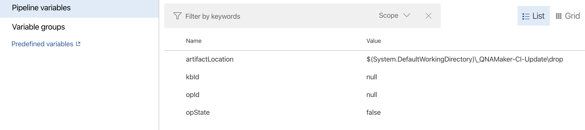

Look at the *artifactLocation -* This is the path of the CI pipeline artifact for CD pipeline for *Update* operation. Other variables are used across PowerShell scripts. You would see references for the same in the scripts' snippets below:

#### **Get and Choose KB -** Chooses a KB from the list of KBs in QnAMaker

```
# Write your PowerShell commands here.

Write-Host "Get and Chose KB";

$url = $(BaseURL) + "/knowledgebases"
$contentType = $(ContentType)

$headers =@{
$(ApiKey) = "$(Ocp-Apim-Subscription-Key)"
};

$response = Invoke-RestMethod -Method "GET" -Uri $url
-ContentType $contentType -Headers $headers

Write-Host $response;

$kbRef = $response.knowledgebases[0];
$knowledgeId = $kbRef.id;
Write-Host $knowledgeId;

"##vso[task.setvariable variable=kbId]$knowledgeId"
```

#### **Update KB -** Updates the chosen KB

```
# Write your PowerShell commands here.

Write-Host "Update KB";

$body = Get-Content $(artifactLocation)\UpdateKB.json;
Write-Host $body;

$url = $(BaseURL) + "/knowledgebases/$(kbId)"
$contentType = $(ContentType)

$headers =@{
$(ApiKey) = "$(Ocp-Apim-Subscription-Key)"
};

$response = Invoke-RestMethod -Method "PATCH" -Uri $url
-ContentType $contentType -Headers $headers -Body $body

Write-Host $response;

$operationId = $response.operationId;
"##vso[task.setvariable variable=opId]$operationId"
```

#### **Check KB Update Status -** Checks the status of the previous step

```
# Write your PowerShell commands here.

Write-Host "Check KB Update Status";

$url = $(BaseURL) + "/operations/$(opId)"
$contentType = $(ContentType)

$headers =@{
$(ApiKey) = "$(Ocp-Apim-Subscription-Key)"
};

$response = Invoke-RestMethod -Method "GET" -Uri $url
-ContentType $contentType -Headers $headers

Write-Host $response;
$operationState = $response.operationState;
Write-Host $operationState

$shouldContinue = $False;
if ($operationState -eq "Running")
{
    Write-Host $operationState
     $shouldContinue = $True;
}
 
"##vso[task.setvariable variable=opState]$shouldContinue"
```

#### **Publish KB -** Publishes a KB in QnAMaker

This is when the KB will be available in QnAMaker portal for use by everyone

```
# Write your PowerShell commands here.

Write-Host "Publish KB";
Write-Host $(opState);

$url = $(BaseURL) + "/knowledgebases/$(kbId)"
$contentType = $(ContentType)

$headers =@{
$(ApiKey) = "$(Ocp-Apim-Subscription-Key)"
};

$response = Invoke-RestMethod -Method "POST" -Uri $url
-ContentType $contentType -Headers $headers;

Write-Host $response;
```

### **UpdateByURL**

#### **Repository folder** - *UpdateByURL*

#### **CI Pipeline**

All Tasks and corresponding PowerShell scripts are same as for *Update* step above

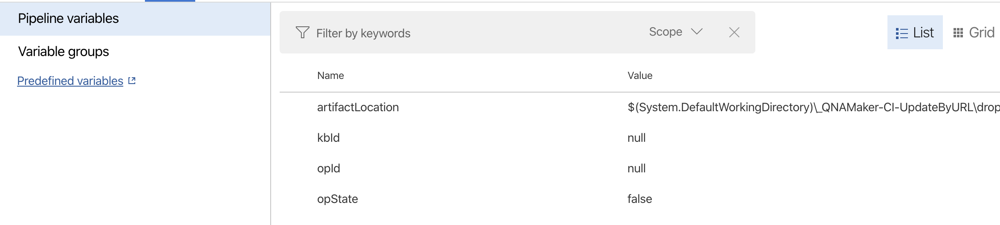

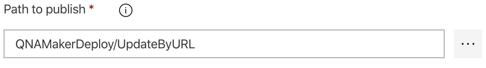


#### **CD** **Pipeline**


Look at the *artifactLocation -* This is the path of the CI pipeline artifact for CD pipeline for *Update* operation. Other variables are used across PowerShell scripts.

All Tasks and corresponding PowerShell scripts are same as for *Update* step above

### **Train Pipelines**

### **Train**

#### **Repository folder** - *Train*

#### **CI Pipeline**


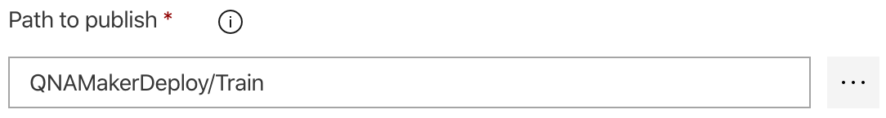


#### **CD** **Pipeline**

#### 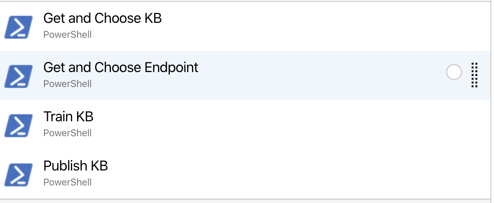

Each Task is only having inline PowerShell script to call appropriate

[QnAMaker REST API](https://westus.dev.cognitive.microsoft.com/docs/services/5a93fcf85b4ccd136866eb37/operations/5ac266295b4ccd1554da75ff).

**Let us examine what each task has in store**:

Pipeline variables for each pipeline are same baring few exceptions:

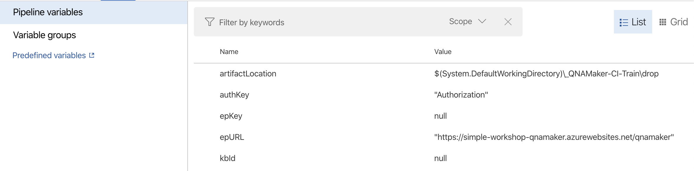

Look at the *artifactLocation -* This is the path of the CI pipeline artifact for CD pipeline for *Update* operation. Other variables are used across PowerShell scripts. You would see references for the same in the scripts' snippets below:

#### **Get and Choose KB -** Chooses a KB from the list of KBs in QnAMaker

```
# Write your PowerShell commands here.

Write-Host "Get and Chose KB";
Write-Host "$(EndpointKey)";

$url = $(BaseURL) + "/knowledgebases"
$contentType = $(ContentType)

$headers =@{
$(ApiKey) = "$(Ocp-Apim-Subscription-Key)"
};

$response = Invoke-RestMethod -Method "GET" -Uri $url
-ContentType $contentType -Headers $headers

Write-Host $response;

$kbRef = $response.knowledgebases[0];
$knowledgeId = $kbRef.id;
Write-Host $knowledgeId;

"##vso[task.setvariable variable=kbId]$knowledgeId"
```

#### **Get and Choose Endpoint -** Chooses an endpoint to Train

```
# Write your PowerShell commands here.

Write-Host "Get and Choose Endpoint";

$url = $(BaseURL) + "/endpointkeys"
$contentType = $(ContentType)

$headers =@{
$(ApiKey) = "$(Ocp-Apim-Subscription-Key)"
};

$response = Invoke-RestMethod -Method "GET" -Uri $url
-ContentType $contentType -Headers $headers

Write-Host $response;

$keyRef = $response.primaryEndpointKey;
Write-Host $keyRef;

"##vso[task.setvariable variable=epKey]$keyRef"
```

#### **Train KB**

```
# Write your PowerShell commands here.

Write-Host "Train KB";

$body = Get-Content $(artifactLocation)\TrainKB.json;
Write-Host $body;

$url = $(epURL) + "/knowledgebases/$(kbId)/train"
$contentType = $(ContentType)

$headers =@{
$(ApiKey) = "$(Ocp-Apim-Subscription-Key)"
$(authKey) = "EndpointKey $(epKey)"
};

$response = Invoke-RestMethod -Method "POST" -Uri $url
-ContentType $contentType -Headers $headers -Body $body

Write-Host $response;
```

#### **Publish KB -** Publishes a KB in QnAMaker

This is when the KB will be available in QnAMaker portal for use by everyone

```
# Write your PowerShell commands here.

Write-Host "Publish KB";

$url = $(BaseURL) + "/knowledgebases/$(kbId)"
$contentType = $(ContentType)

$headers =@{
$(ApiKey) = "$(Ocp-Apim-Subscription-Key)"
};

$response = Invoke-RestMethod -Method "POST" -Uri $url
-ContentType $contentType -Headers $headers;

Write-Host $response;
```

So you have seen how we can use various ways to update QnAMaker with Automation using Azure DevOps (ADO) with the help of PowerShell.

 One final this I would like highlight is the need for ***Variable Group.*** This is something extremely important for any workload on *Azure DevOp*s - Variables needed by all pipelines of the project. You need to go to Library section of project and add/modify intended values.

Many variables in the whole process can be secure variables and need to be stored in KeyVault; and application providers all create their own version of ***KeyVault\*** access code to read the secured data at runtime and then use it in-memory. The downside of this approach is that everyone has to know lot of details of KeyVault while using it in their code; which as per new security standards should be avoided - there should be only one source of truth - ADO's KeyVault integration fills that gap.

I will discuss this in details in a separate article, but for now let su look at the variables Group section for Deployment pipelines to see how values are being read and stored from KeyVault by ADO before starting any pipeline tasks, making the whole process seamless

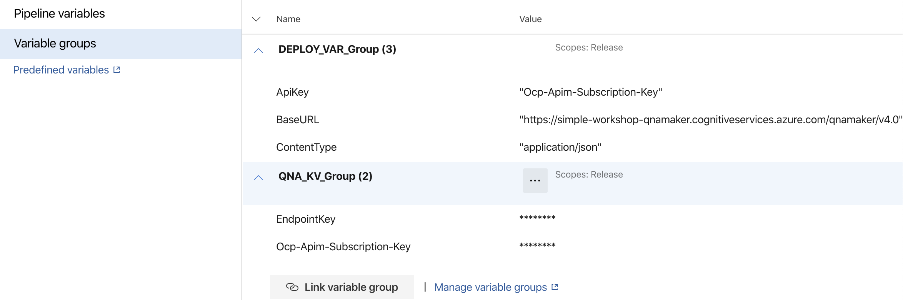

From the Fig. as you can -

**DEPLOY_VAR_GROUP** is the Variable Group name for all ***Non-Secured*** variables used across all pipelines

**QNA_KV_GROUP** is the Variable Group name for all ***Secured variables*** used across all pipelines

With this we conclude this discussion here. Would request all to try this out by referring the source code in Github; feel free to do more improvements to this and reach out to me in case of any further questions

 

=======================================X===================================